> ARCHIVED 2026-06-19 — 內容已併入 docs/phantom-quant.md;此為歷史版本。

# 路線圖（繁體中文視覺版）

> **phantom-quant 是台股 backtest → paper → live 交易引擎。**
> 護城河 = **決定性（deterministic）+ 可稽核（auditable）+ 台股微結構**（手續費／證交稅／tick／±10% 漲跌停）——
> 這三點是 NautilusTrader／Qlib／backtrader 等大框架預設都不模型的東西,是要守住的資產。
>
> 📌 **英文 grounded 狀態 SSOT 見 [ROADMAP.md](ROADMAP.md)**(每個「已出貨」項都對應 `master` 上的真實 commit)。
> 本檔是它的繁中視覺伴隨版,不另立真相;若兩者衝突,以 `ROADMAP.md` + 實際 commit 為準。
> 生態與選型依據見 [docs/OSS-LANDSCAPE-AND-DIRECTION.md](docs/OSS-LANDSCAPE-AND-DIRECTION.md)。
>
> _對應狀態(依 `ROADMAP.md`):`master` @ `ed6a1f1` — 126 passing tests、3 個 CLI 子指令（`backtest`/`paper`/`import-csv`）、1 個策略（`sma_cross`)。_
>
> ⚠️ 階段一/二/三的**具體選型**（FinMind／vectorbt／Shioaji)來自 `docs/OSS-LANDSCAPE-AND-DIRECTION.md` 的**建議路線**,
> 屬「候選方向」非英文 SSOT 已鎖定的承諾;英文 `ROADMAP.md` 只寫到「更多策略／更多風險指標／CSV 外的資料來源／live broker」這層。

---

## 一、狀態總覽（Mermaid）

```mermaid
flowchart LR
    subgraph S0["✅ 已出貨（master）"]
        A1["台股成本核<br/>Bar / Decimal 組合 / 手續費稅 tick<br/>±10% 漲跌停 / 滑價"]
        A2["離線資料層<br/>BarProvider ABC<br/>CSV / Parquet / Cached"]
        A3["事件式回測引擎<br/>+ BarEventDriver"]
        A4["可稽核產物<br/>trades/equity/run.json<br/>byte-stable golden"]
        A5["模擬 paper 核<br/>paper == backtest 已證"]
        A6["StrategyRegistry<br/>+ 風險指標 Sharpe/CAGR/vol"]
    end

    subgraph S1["🚧 階段一:便宜高值"]
        B1["+2–3 個 registry 策略"]
        B2["更多風險指標<br/>Sortino/Calmar/MDD-duration"]
        B3["FinMind 線上資料邊<br/>(fetch-once → Parquet)"]
        B4["vectorbt 研究 sweep<br/>(僅 pattern,選用)"]
    end

    subgraph S2["📅 階段二:執行邊"]
        C1["Shioaji Broker ABC<br/>paper-live"]
        C2["真錢路徑<br/>governor + 手機核准<br/>預設 OFF"]
    end

    subgraph S3["🔭 階段三:獨特利基"]
        D1["phantom-mesh agent<br/>當訊號消費者"]
        D2["決定性回測 + 受治理執行<br/>= LLM-agent 的安全執行層"]
    end

    S0 --> S1 --> S2 --> S3
```

---

## 二、分期表

> 排序原則:① **便宜高值優先** ② **護城河優先於廣度** ③ 需裝置／真錢／操作者決策的**排後並標明** ④ 明列**刻意不做**。

### ✅ 已出貨（grounded,對應真實 commit)

| 項目 | 具體內容 | 對應 commit / 證據 |
|---|---|---|
| 台股成本核 | frozen `Bar`、`Decimal` 組合、手續費／證交稅／tick 成本模型、事件式 `Strategy`/`Order`/`Context` 合約 | `425387b` `7e35ada` `acf843b` `fdd7a11` |
| 漲跌停 + 滑價 + 驗證 | ±10% 漲跌停 fill gating、滑價模型、結構性 bar 驗證（壞資料 `rc=2` 直接 fail） | `e2aa7bb` `a70744b` `a1ae299` |
| 離線資料層 | `BarProvider` ABC、`CsvProvider`、Parquet store、`CachedProvider`、`import-csv` | `b023cd3` `5ef4576` `9380c6d` |
| 回測引擎 + 產物 | SMA 事件式引擎、byte-stable 可稽核產物（`trades/equity/run.json/report.md`,golden-byte 測試) | `e47e22f` `10e8b94` |
| paper 核 + registry | `BarEventDriver`、模擬 `PaperBroker`/`PaperAccount`（`paper == backtest` 已證)、`StrategyRegistry`、`paper` CLI | `e317fa9` `f0ecf97` `5a19839` `ac537ff` |
| 風險指標 | annualized Sharpe / CAGR / vol(由 equity 曲線推導,stdlib) | `ed6a1f1` |

> 目前:**126 passing tests**、3 個 CLI 子指令、1 個策略。原始碼已驗對得上(`paper.py`/`driver.py`/`registry.py`/`limit_lock.py`/`slippage.py`/`validation.py`/`artifacts.py` 皆在,尚無 `broker.py`/shioaji 路徑)。

### 🚧 階段一 — 便宜高值（先做,不需裝置/真錢)

| 目標 | 具體項 | 在哪做 | 風險 / 前置 |
|---|---|---|---|
| 加策略廣度 | 經既有 `StrategyRegistry` 加 **2–3 個參考策略**(動量／突破、均值回歸） | z13 編排;codex/claude 寫,codex+agy 對讀審 | 低。seam 已就緒,純加法 |
| 補風險指標 | 既有 Sharpe/CAGR/vol 之上加 **Sortino / Calmar / 最大回撤期間**(同由 equity 曲線推導,stdlib) | z13;codex/claude 寫 | 低。純加法,有 SSOT 背書(英文 ROADMAP `Planned-next`) |
| 補資料邊 | **FinMind** 線上 `BarProvider` → 寫入既有 Parquet cache(fetch-once-then-cache,回測仍離線決定性) | acer/ayaneo on-demand 跑取數 | 低。FinMind 免註冊;license MIT-ish 上線前確認 |
| 研究 sweep(選用) | 借 **vectorbt** 的 pattern 做參數掃描研究模式 | z13 | ⚠️ 只在單跑回測太慢時才做;**否則 over-build** |

### 📅 階段二 — 執行邊（排後,牽涉真錢)

| 目標 | 具體項 | 在哪做 | 風險 / 前置 |
|---|---|---|---|
| 接券商 | 實作已宣告的 `Broker` ABC against **Shioaji**(永豐金,台股原生);保留模擬 `PaperBroker` 為**預設** | acer/ayaneo(需 Shioaji 環境）;高風險變更走雙閘 | 中。Shioaji SDK license 上線前須確認 |
| 真錢路徑 | live 下單走 **governor + 雙閘 + 手機核准**;真錢**預設 OFF**、對稱 off-switch | 操作者決策 + 手機核准 | 🔴 高。真錢=危險區。可稽核產物剛好當 live flight-recorder |

### 🔭 階段三 — 獨特利基（護城河的兌現)

| 目標 | 具體項 | 在哪做 | 風險 / 前置 |
|---|---|---|---|
| agent 橋接 | 開一薄介面:phantom-mesh agent 能(i)請求對某策略/參數做**決定性回測**、(ii)送**受治理的** paper/live 單 | z13 編排 + phantom-mesh 生態 | 前置=階段二的 governor/手機核准底座 |
| 安全執行層 | 定位:agent 出訊號 → phantom-quant 決定性 paper 驗證 → 受治理 live 執行。**這是別人(TradingAgents/ai-hedge-fund 都只出訊號不執行)填不了的縫** | — | 這就是 phantom-quant 在生態裡**獨特、可防禦**的位置 |

---

## 三、刻意不做 / over-build 風險

| 別做 | 原因 |
|---|---|
| ❌ **砍核心去採 NautilusTrader / Qlib / LEAN** | 每個都是多年期重框架;採用=用可稽核台股核換你不需要的通用性。守住核心,別重寫 |
| ❌ 早期做 **RL（FinRL)** | 高成本、脆弱、單人很難贏過簡單 baseline。當研究好奇心,不進路線圖 |
| ❌ 早期 **fine-tune 金融 LLM（FinGPT)** | 同上,投報比差 |
| ❌ 衍生 **GPL 程式碼(backtrader / Freqtrade)** | 會把授權傳染成 GPL/AGPL。參考優先選 MIT/Apache(Qlib/vectorbt/Zipline-reloaded/TradingAgents/ai-hedge-fund) |
| ⚠️ 過早做 **vectorbt 研究模式** | 只在單跑回測太慢時才值得;否則 over-build |
| ⚠️ 把 vectorbt / FinMind / Shioaji **當核心重寫而非邊緣 adopt** | 只在「資料邊」「執行邊」兩處 adopt-as-is,核心保持決定性可稽核 |

---

> 圖例:✅ 已出貨 ｜ 🚧 進行中/近期 ｜ 📅 之後 ｜ 🔭 願景 ｜ 🔴 高風險 ｜ ⚠️ over-build 警戒
