# phantom-quant — 唯一主文件

> 本檔為 phantom-quant 唯一主文件;英文狀態細節與舊版見 `docs/_archive/`。
> 對應狀態:`master` @ `ed6a1f1` — 126 passing tests、3 個 CLI 子指令（`backtest`/`paper`/`import-csv`）、1 個策略（`sma_cross`)。每個「已出貨」項都對應 `master` 上的真實 commit。

## 目錄
- [定位與護城河](#定位與護城河)
- [快速上手](#快速上手)
- [狀態與視覺路線圖](#狀態與視覺路線圖)
- [開源生態與方向](#開源生態與方向)
- [刻意不做 / over-build 風險](#刻意不做--over-build-風險)

---

## 定位與護城河

**phantom-quant 是一套台股（Taiwan-stock）的 backtest → paper → live 交易引擎,屬 phantom-mesh 生態系的一部分。** 以 Python 撰寫,封裝為 `phantom-quant`,附帶 CLI（`backtest`、`paper`、`import-csv`)。

- **離線、可稽核、確定性。** 回測完全離線,僅以快取的 CSV/Parquet K 線為來源 —— 執行期無券商、無網路、無真實金錢。產出物（`trades.csv`、`equity.csv`、`run.json`、`report.md`)位元穩定（byte-stable）、確定性,以 golden-byte 測試把關;執行期不取時鐘／SHA,使輸出可重現。
- **護城河 = 決定性（deterministic）+ 可稽核（auditable）+ 台股微結構**(手續費／證交稅／tick／±10% 漲跌停)。這三點是 NautilusTrader／Qlib／backtrader 等大框架預設都不模型的東西,是要守住的資產。差異化*並非*廣度或效能,而是這個小巧、紀律嚴明、以正確性為先的單一資產類別引擎。

---

## 快速上手

### Quickstart（Windows / PowerShell)
```powershell
python -m venv .venv
.\.venv\Scripts\python.exe -m pip install -e ".[test]"
$env:PYTHONUTF8="1"
.\.venv\Scripts\python.exe -m pytest -q
.\.venv\Scripts\phantom-quant.exe backtest --csv tests\fixtures\sample_2330_1d.csv --strategy sma_cross --symbol 2330 --short 3 --long 6 --cash 1000000 --out report.md
```

該 demo 印出一次真實回測:total return **2.46%**、max drawdown 1.74%、2 筆交易（一次 buy/sell round-trip)於內附的 2330 fixture —— 每個數字都可由 equity 曲線重新推導,且已收台股 fees/tax。`--short`/`--long` 調 SMA 視窗（預設 5/20)。

### Backtest 選項

| flag | 效果 |
|------|------|
| `--slippage-bps N` | N 個 basis point 的逆向滑價（買填高、賣填低),clamp 進該 bar 的成交區間。`0` = 無摩擦（預設)。 |
| `--cache DIR` | Parquet cache:某 symbol/timeframe/range 抓一次,後續重用。 |
| `--no-validate` | 跳過結構性 bar 驗證（OHLC 合理性、排序、重複、finite/positive 價格)。驗證**預設開啟** —— 壞資料大聲失敗（`rc=2`),絕不在悄悄錯誤的 bar 上回測。 |
| `--artifacts DIR` | 額外寫出可稽核產物（見下)。 |

### 可稽核產物

`--artifacts DIR` 寫出一份**位元穩定**的執行紀錄:

- `trades.csv` —— 完整 trade tape（`ts,symbol,side,qty,price,cost,status,reason`),含 gated/rejected 訂單。
- `equity.csv` —— mark-to-market equity 曲線（`ts,equity`)。
- `run.json` —— 執行 metadata（symbol、strategy、params、cash、date range)+ 每個 metric（return、drawdown、realized PnL、costs paid、win/loss、gated/rejected counts)。
- `report.md` —— 人類可讀摘要。

檔案是確定性的:LF 行尾、排序/縮排 JSON、**執行期絕不計算 runtime clock 或 git SHA** —— 若要蓋上,傳 `--git-sha`/`--version`/`--generated-at`,輸出仍可重現。golden test 釘住一次固定回測的位元;要刻意重新產生用 `PHANTOM_QUANT_UPDATE_GOLDEN=1 pytest tests/test_artifacts.py`。

```powershell
.\.venv\Scripts\phantom-quant.exe backtest --csv tests\fixtures\sample_2330_1d.csv `
    --strategy sma_cross --symbol 2330 --short 3 --long 6 --cash 1000000 `
    --slippage-bps 10 --cache .\cache --artifacts .\run --out report.md
```

---

## 狀態與視覺路線圖

> 排序原則:① **便宜高值優先** ② **護城河優先於廣度** ③ 需裝置／真錢／操作者決策的**排後並標明** ④ 明列**刻意不做**。
> 每個「已出貨」項對應 `master` 上的真實 commit;測試數/報酬取自 merge 訊息與內附 fixture,無虛構。階段一/二/三的**具體選型**(FinMind／vectorbt／Shioaji)屬下方〈開源生態與方向〉的**建議路線**(候選方向),非已鎖定承諾。

### 狀態總覽（Mermaid)

```mermaid
flowchart LR
    subgraph S0["✅ 已出貨（master）"]
        A1["台股成本核<br/>Bar / Decimal 組合 / 手續費稅 tick<br/>±10% 漲跌停 / 滑價"]
        A2["離線資料層<br/>BarProvider ABC<br/>CSV / Parquet / Cached"]
        A3["事件式回測引擎<br/>+ BarEventDriver"]
        A4["可稽核產物<br/>trades/equity/run.json<br/>byte-stable golden"]
        A5["模擬 paper 核<br/>paper == backtest 已證"]
        A6["StrategyRegistry<br/>+ 風險指標 Sharpe/CAGR/vol"]
    end

    subgraph S1["🚧 階段一:便宜高值"]
        B1["+2–3 個 registry 策略"]
        B2["更多風險指標<br/>Sortino/Calmar/MDD-duration"]
        B3["FinMind 線上資料邊<br/>(fetch-once → Parquet)"]
        B4["vectorbt 研究 sweep<br/>(僅 pattern,選用)"]
    end

    subgraph S2["📅 階段二:執行邊"]
        C1["Shioaji Broker ABC<br/>paper-live"]
        C2["真錢路徑<br/>governor + 手機核准<br/>預設 OFF"]
    end

    subgraph S3["🔭 階段三:獨特利基"]
        D1["phantom-mesh agent<br/>當訊號消費者"]
        D2["決定性回測 + 受治理執行<br/>= LLM-agent 的安全執行層"]
    end

    S0 --> S1 --> S2 --> S3
```



### ✅ 已出貨（grounded,對應真實 commit)

| 項目 | 具體內容 | 對應 commit / 證據 |
|---|---|---|
| 台股成本核 | frozen `Bar`、`Decimal` 組合、手續費／證交稅／tick 成本模型、事件式 `Strategy`/`Order`/`Context` 合約 | `425387b` `7e35ada` `acf843b` `fdd7a11` |
| 漲跌停 + 滑價 + 驗證 | ±10% 漲跌停 fill gating、滑價模型、結構性 bar 驗證（壞資料 `rc=2` 直接 fail) | `e2aa7bb` `a70744b` `a1ae299` |
| 離線資料層 | `BarProvider` ABC、`CsvProvider`、Parquet store、`CachedProvider`、`import-csv` | `b023cd3` `5ef4576` `9380c6d` |
| 回測引擎 + 產物 | SMA 事件式引擎、byte-stable 可稽核產物（`trades/equity/run.json/report.md`,golden-byte 測試) | `e47e22f` `10e8b94` |
| paper 核 + registry | `BarEventDriver`、模擬 `PaperBroker`/`PaperAccount`（`paper == backtest` 已證)、`StrategyRegistry`、`paper` CLI | `e317fa9` `f0ecf97` `5a19839` `ac537ff` |
| 風險指標 | annualized Sharpe / CAGR / vol(由 equity 曲線推導,stdlib) | `ed6a1f1` |

> 目前:**126 passing tests**、3 個 CLI 子指令、1 個策略。原始碼已驗對得上（`paper.py`/`driver.py`/`registry.py`/`limit_lock.py`/`slippage.py`/`validation.py`/`artifacts.py` 皆在,尚無 `broker.py`/shioaji 路徑)。

### 🚧 階段一 — 便宜高值（先做,不需裝置/真錢)

| 目標 | 具體項 | 在哪做 | 風險 / 前置 |
|---|---|---|---|
| 加策略廣度 | 經既有 `StrategyRegistry` 加 **2–3 個參考策略**(動量／突破、均值回歸) | orchestrator node (Win) 編排;codex/claude 寫,codex+agy 對讀審 | 低。seam 已就緒,純加法 |
| 補風險指標 | 既有 Sharpe/CAGR/vol 之上加 **Sortino / Calmar / 最大回撤期間**(同由 equity 曲線推導,stdlib) | orchestrator node (Win);codex/claude 寫 | 低。純加法,有 SSOT 背書（英文 ROADMAP `Planned-next`) |
| 補資料邊 | **FinMind** 線上 `BarProvider` → 寫入既有 Parquet cache（fetch-once-then-cache,回測仍離線決定性) | a Windows node on-demand 跑取數 | 低。FinMind 免註冊;license MIT-ish 上線前確認 |
| 研究 sweep(選用) | 借 **vectorbt** 的 pattern 做參數掃描研究模式 | orchestrator node (Win) | ⚠️ 只在單跑回測太慢時才做;**否則 over-build** |

### 📅 階段二 — 執行邊（排後,牽涉真錢)

| 目標 | 具體項 | 在哪做 | 風險 / 前置 |
|---|---|---|---|
| 接券商 | 實作已宣告的 `Broker` ABC against **Shioaji**(永豐金,台股原生);保留模擬 `PaperBroker` 為**預設** | a Windows node(需 Shioaji 環境);高風險變更走雙閘 | 中。Shioaji SDK license 上線前須確認 |
| 真錢路徑 | live 下單走 **governor + 雙閘 + 手機核准**;真錢**預設 OFF**、對稱 off-switch | 操作者決策 + 手機核准 | 🔴 高。真錢=危險區。可稽核產物剛好當 live flight-recorder |

### 🔭 階段三 — 獨特利基（護城河的兌現)

| 目標 | 具體項 | 在哪做 | 風險 / 前置 |
|---|---|---|---|
| agent 橋接 | 開一薄介面:phantom-mesh agent 能(i)請求對某策略/參數做**決定性回測**、(ii)送**受治理的** paper/live 單 | orchestrator node (Win) 編排 + phantom-mesh 生態 | 前置=階段二的 governor/手機核准底座 |
| 安全執行層 | 定位:agent 出訊號 → phantom-quant 決定性 paper 驗證 → 受治理 live 執行。**這是別人(TradingAgents/ai-hedge-fund 都只出訊號不執行)填不了的縫** | — | 這就是 phantom-quant 在生態裡**獨特、可防禦**的位置 |

> 圖例:✅ 已出貨 ｜ 🚧 進行中/近期 ｜ 📅 之後 ｜ 🔭 願景 ｜ 🔴 高風險 ｜ ⚠️ over-build 警戒

### 明確尚未建置

任何**實盤券商下單路徑**(`pyproject.toml` 中宣告了 `Broker` ABC 與一個選用的 `shioaji` extra,但尚無實盤路徑);超過一支以上的策略;任何**線上市場資料抓取器**(依設計,所有 provider 皆僅限離線)。

---

## 開源生態與方向

> 研究參考彙整於 2026-06-19。每項專案陳述皆有擷取來源佐證（GitHub 倉庫頁面或 2025/2026 網路來源);星數／授權／活躍度引用自這些來源。凡未經直接查證的數據皆標記 `[unverified]`。本節為決策輔助,非規格書 —— 專案狀態以上方〈狀態與視覺路線圖〉為準。

**核心論點:保持可稽核、確定性、台股原生的核心（CORE）原樣不動,並停止試圖在工程上勝過大型框架。僅在 phantom-quant 真正薄弱的兩個邊緣採用開源 —— (a) 線上資料擷取 與 (b) 實盤執行 —— 並把*代理層（agent layer)*定位為差異化所在,而非回測引擎。**

### 2.1 經典量化框架 —— 回測 +(有時)實盤

| Project | What it is | URL | Lang | License | Maturity / activity | Backtest / Live |
|---|---|---|---|---|---|---|
| **NautilusTrader** | 生產級、Rust-core + Python 事件驅動引擎;回測與實盤「零程式碼變更對等」。 | https://github.com/nautechsystems/nautilus_trader | Rust + Python | LGPL-3.0 `[unverified license]` | ~23.6k★;**非常活躍**(v1.228.0 Beta, 2026-06-08) | 兩者皆有 |
| **backtrader** | 經典事件驅動 Python 回測函式庫（含部分券商整合)。 | https://github.com/mementum/backtrader | Python | GPL-3.0 | ~22k★;**維護模式** | 回測 + 部分實盤 |
| **vectorbt** | 向量化（NumPy/pandas/Numba）回測器,用於大規模參數掃描。 | https://github.com/polakowo/vectorbt | Python | Apache-2.0 `[unverified license]` | ~6.8k★;活躍;有付費 PRO 版 | 回測（研究用) |
| **Zipline-reloaded** | Stefan-Jansen 維護的 Quantopian Zipline 分支;事件驅動回測器。 | https://github.com/stefan-jansen/zipline-reloaded | Python | Apache-2.0 `[unverified license]` | 2025 積極維護（Py 3.9+) | 回測 |
| **QuantConnect LEAN** | 久經沙場的雲端平台骨幹;股票/外匯/期貨/選擇權/加密。 | https://github.com/QuantConnect/Lean `[unverified URL]` | C# + Python | Apache-2.0 | 活躍、規模大 | 兩者皆有 |
| **Freqtrade** | 加密貨幣交易機器人 → 完整策略框架;回測 + **實盤**、FreqAI、Telegram UI。 | https://github.com/freqtrade/freqtrade | Python | **GPL-3.0** | ~51.6k★;**非常活躍**(2026.5.1) | 兩者皆有（僅加密) |
| **Jesse** | 加密貨幣策略研究 + 實盤框架。 | https://github.com/jesse-ai/jesse `[unverified URL]` | Python | MIT | 活躍 | 兩者皆有（加密) |
| **Hummingbot** | CEX + DEX 造市／自動化交易框架。 | https://github.com/hummingbot/hummingbot `[unverified URL]` | Python | Apache-2.0 | 活躍 | 實盤（加密造市) |
| **vn.py** | 聚焦中國市場的完整量化平台（CTP 等)。 | https://github.com/vnpy/vnpy `[unverified URL]` | Python | MIT `[unverified]` | 活躍（A 股／期貨) | 兩者皆有 |

**對 phantom-quant 的啟示:**
- 加密貨幣機器人（Freqtrade/Jesse/Hummingbot)是**錯誤的資產類別**(台股,非加密) —— 僅可作實盤迴圈／風控／Telegram 控制設計的*樣式*參考,不適合作基底。
- **GPL-3.0(backtrader、Freqtrade)** 是實質限制:連結／衍生會迫使 phantom-quant 也變成 GPL。phantom-mesh 核心採 **AGPL**,故 GPL 算相容,但仍值得做一次自覺的授權決策。**Apache-2.0/MIT** 選項則較易混用。
- **NautilusTrader** 是最可信的「回測==實盤對等、生產級」引擎,但很**沉重** —— 採用=繼承龐大相依並在其抽象中重新表達台股成本模型,對單兵引擎很可能**過度建置**。
- **vectorbt** 是最強的*互補品*:phantom-quant 事件驅動引擎以正確性為先但掃描偏慢;vectorbt 恰相反。是**研究級掃描輔助**,非可稽核核心的替代。

### 2.2 AI / ML / LLM-agent 交易

| Project | Approach | URL | Lang | License | Maturity | Real vs demo |
|---|---|---|---|---|---|---|
| **Microsoft Qlib** | AI 導向量化平台:監督 ML + RL + 市場動態建模;已整合 RD-Agent。 | https://github.com/microsoft/qlib | Python | **MIT** | ~44.8k★;v0.9.7(2025-08-15) | **真實**研究平台 |
| **FinRL**(AI4Finance) | 交易用深度強化學習函式庫。 | https://github.com/AI4Finance-Foundation/FinRL `[unverified URL]` | Python | MIT `[unverified]` | 活躍 | 研究／教育 |
| **FinGPT**(AI4Finance) | 金融 NLP 的 LLM 試驗場（LoRA 微調)。 | https://github.com/AI4Finance-Foundation/FinGPT `[unverified URL]` | Python | MIT `[unverified]` | 活躍 | 研究 |
| **TradingAgents**(Tauric) | **多代理 LLM** 公司模擬;LangGraph;眾多供應商含 **Ollama(本地)**、Anthropic、OpenAI。 | https://github.com/TauricResearch/TradingAgents | Python | **Apache-2.0** | ~87.2k★;v0.2.5(2026-05-11) | **僅研究/示範**(模擬執行) |
| **virattt/ai-hedge-fund** | 多代理系統,19 個代理;支援 Ollama 本地。 | https://github.com/virattt/ai-hedge-fund | Python | **MIT** | ~60.2k★;2026-06-17 | **僅模擬** —— 「實際上不會交易」 |

**啟示:**
- 大型 LLM-agent 倉庫（**TradingAgents**、**ai-hedge-fund**)**明確只做訊號生成／決策模擬 —— 不執行交易。** 這正是 phantom-mesh+phantom-quant 可填補的缺口:在代理訊號底下,提供一層*受治理、可稽核的執行 + 模擬交易基底*。兩者皆支援**本地 Ollama**,契合 local-first／BYO-model 立場。
- **Qlib** 是嚴肅 ML 研究平台（MIT),但資料以中國 A 股為中心且沉重;可作**特徵/alpha 研究來源**,非執行基底。
- **RL(FinRL)** 高投入、脆弱,單兵鮮少勝過簡單 baseline —— **誠實警告:初期不值得。**

### 2.3 交易自動化／執行包裝層

| Project | What it is | URL | Lang | License | Notes |
|---|---|---|---|---|---|
| **Shioaji(永豐金)** | 官方永豐金跨平台交易 API —— **台股股票/期貨/選擇權**,原生 Python,即時資料 + 下單 + 帳務。 | https://github.com/Sinotrade/Shioaji | Python(+others) | proprietary-ish broker SDK `[verify license]` | **台股實盤的正確券商** —— 已宣告於 `broker` extra。 |
| **ccxt** | 橫跨 **105 個加密交易所** 的統一 API。 | https://github.com/ccxt/ccxt | 多語言 | **MIT** | ~43k★;極活躍。**僅加密 —— 非台股。** |
| **alpaca-py** | 官方 Alpaca SDK —— 美股/加密,模擬 + 實盤。 | https://github.com/alpacahq/alpaca-py `[unverified URL]` | Python | Apache-2.0 `[unverified]` | 美國市場;良好的*模擬交易*參考。 |
| **ib_insync** | 對 Interactive Brokers 的 Pythonic 包裝。 | https://github.com/erdewit/ib_insync `[unverified URL]` | Python | BSD `[unverified]` | IBKR 可觸及 TW,但 Shioaji 原生契合。原專案已封存,社群以 `ib_async` 延續 `[verify]`。 |

**啟示:** 對台股實盤,**Shioaji 是要包裝的那一個** —— 已是規劃中的 `broker` extra。ccxt/alpaca/ib_insync 皆超出資產類別,僅在範圍擴張時才重要。

### 2.4 資料來源（免費／便宜,與台股相關)

| Source | What | URL | Notes |
|---|---|---|---|
| **FinMind** | 開放、聚焦台股:50+ 資料集（日線 + 自 2019-05 起 5 秒 tick、財報、法人買賣超),每日更新 Python SDK。 | https://github.com/FinMind/FinMind | **無須註冊**(300 req/hr;免費 token 600)。**最佳免費台股抓取器。** |
| **Shioaji market data** | 透過券商 API 取得即時 + 歷史台股報價。 | https://github.com/Sinotrade/Shioaji | 與實盤執行自然搭配。 |
| **TWSE / TPEx open data** | 官方交易所端點（代碼、日線)。 | https://www.twse.com.tw `[reference]` | 權威但原始;FinMind 已包裝大部分。 |
| **twstock** | 輕量台股報價函式庫。 | https://github.com/mlouielu/twstock `[unverified URL]` | 簡單;完整度不如 FinMind。 |

### 建議方向 / 分階段路徑（務實、單兵尺度)

- **保留／請勿替換:** 事件驅動引擎、`Decimal` 投資組合、台股成本模型、漲跌停／成交把關、確定性產出物、paper==backtest 等價。這份可稽核性是護城河;在 NautilusTrader/Zipline 上重建只會*失去*它。
- **在資料邊緣直接採用:** 新增由 **FinMind**(免費、台股原生、免註冊)支撐的*線上* `BarProvider`,寫入既有 Parquet 快取(抓一次後即快取,回測仍離線/確定性),消除「僅限 CSV」缺口。
- **在執行邊緣直接採用:** 針對 **Shioaji** 實作已宣告的 `Broker` ABC,作實盤/模擬實盤路徑。保留模擬 `PaperBroker` 為預設,真實金錢路徑閘控在明確治理之後(契合 ④-安全無人值守 + governor + 手機核可)。
- **向 vectorbt 借樣式而非借程式碼,** 供未來「研究模式」參數掃描 —— 僅在單次回測太慢時才需要,在那之前都屬**過度建置**。
- **把 LLM-agent 層（phantom-mesh)定位為訊號的消費者,而非重寫:** 大型代理倉庫**刻意不執行**;phantom-quant 那受治理、可稽核的 回測→模擬→實盤 基底,正是它們底下所缺的「安全執行底盤」。整合:*代理發訊號 → phantom-quant 確定性回測/模擬驗證 → 透過 Shioaji 受治理實盤執行*。這就是獨特、可防禦的利基。

**務實階段路徑:** ① P-next-A FinMind 線上資料(低風險,消除最大缺口)→ ② P-next-B 經 registry 擴增 2–3 策略(便宜高值)→ ③ P-next-C Shioaji 模擬實盤 `Broker`(閘控於治理後,真錢預設 OFF)→ ④ P-next-D phantom-mesh 代理橋接(生態獨有之處)→ ⑤ P-later(選用)vectorbt 研究模式。

### 最值得採用的單一開源（精選短名單)

1. **FinMind** — https://github.com/FinMind/FinMind — 免費、台股原生資料;資料邊緣採用對象。
2. **Shioaji** — https://github.com/Sinotrade/Shioaji — 實盤/模擬實盤的原生台股券商;已在 `broker` extra。
3. **vectorbt** — https://github.com/polakowo/vectorbt — Apache-2.0 向量化掃描;未來研究模式的*互補品*,非核心替代。
4. **TradingAgents** — https://github.com/TauricResearch/TradingAgents — Apache-2.0、~87k★,多代理 LLM 訊號層參考(可用本地 Ollama);它*不執行* → 正是 phantom-quant 填補的缺口。
5. **virattt/ai-hedge-fund** — https://github.com/virattt/ai-hedge-fund — MIT、~60k★,同課題(只有訊號、不執行);代理橋接的架構參考。

> 來源（擷取於 2026-06-19):Qlib(44.8k★,MIT,v0.9.7)、TradingAgents(87.2k★,Apache-2.0,v0.2.5)、ai-hedge-fund(60.2k★,MIT)、Freqtrade(51.6k★,GPL-3.0)、backtrader(~22k★,GPL-3.0)、ccxt(~43k★,MIT)、Shioaji、FinMind、NautilusTrader(~23.6k★,v1.228.0)、vectorbt(~6.8k★)、zipline-reloaded(2025 維護)。

---

## 刻意不做 / over-build 風險

| 別做 | 原因 |
|---|---|
| ❌ **砍核心去採 NautilusTrader / Qlib / LEAN** | 每個都是多年期重框架;採用=用可稽核台股核換你不需要的通用性。守住核心,別重寫。 |
| ❌ 早期做 **RL(FinRL)** | 高成本、脆弱、單人很難贏過簡單 baseline。當研究好奇心,不進路線圖。 |
| ❌ 早期 **fine-tune 金融 LLM(FinGPT)** | 同上,投報比差。 |
| ❌ 衍生 **GPL 程式碼(backtrader / Freqtrade)** | 會把授權傳染成 GPL/AGPL。參考優先選 MIT/Apache(Qlib/vectorbt/Zipline-reloaded/TradingAgents/ai-hedge-fund)。 |
| ⚠️ 過早做 **vectorbt 研究模式** | 只在單跑回測太慢時才值得;否則 over-build。 |
| ⚠️ 把 vectorbt / FinMind / Shioaji **當核心重寫而非邊緣 adopt** | 只在「資料邊」「執行邊」兩處 adopt-as-is,核心保持決定性可稽核。 |

**最大風險 = 範圍蔓延成通用框架。** NautilusTrader/Qlib/LEAN 很誘人,但每套都是多年期平台;採用其一=拿可稽核的台股核心去換單兵操作者不需要的通用性。**抵抗它。** 真實金錢=危險區:閘控在治理 + 手機核可之後、預設 OFF、對稱 off-switch;既有可稽核產物正是 live flight-recorder 的正確基底。各 `[unverified]` 標記在寫入程式碼/相依前皆應對照活躍倉庫確認。
