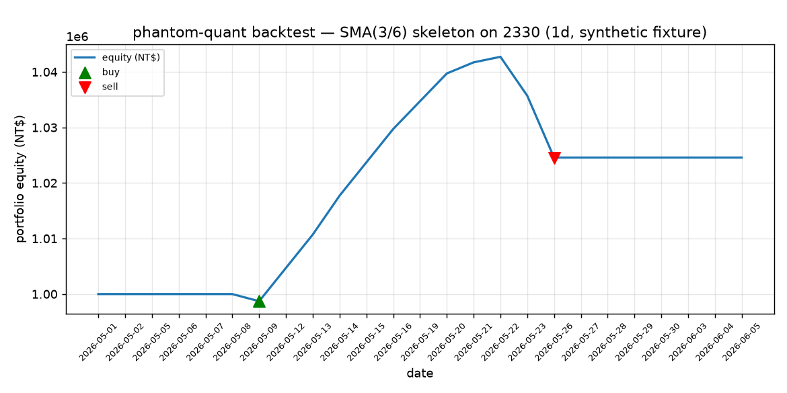

# Sample backtest report

Generated by running the **bundled fixture** through the offline backtest engine:

```bash
phantom-quant backtest \
  --csv tests/fixtures/sample_2330_1d.csv \
  --strategy sma_cross --symbol 2330 \
  --short 3 --long 6 --cash 1000000 --qty 1000 \
  --out report.md
```

The fixture (`tests/fixtures/sample_2330_1d.csv`) is **synthetic** — 25 daily OHLCV
bars for symbol `2330` over 2026-05-01 → 2026-06-05, hand-built to trigger one
SMA(3/6) crossover round-trip. It is not real market data.

## Result (re-derivable, not hand-edited)

```
# phantom-quant backtest

- strategy: `sma_cross`  ·  symbol: `2330`
- start equity: 1000000  →  end equity: 1024574.0
- **total return: 2.46%**
- max drawdown: 1.74%
- trades: 2 (closed: 1)
```



## Trade log

| date       | side | qty  | price | cost (NT$) |
|------------|------|------|-------|------------|
| 2026-05-09 | buy  | 1000 | 905.0 | 1289       |
| 2026-05-26 | sell | 1000 | 935.0 | 4137       |

## Every number is independently auditable

The TW (台股 現股) cost model is the point of this project, so the numbers are
worked out by hand below — they match the engine output exactly.

- **Buy fee** = 905 × 1000 × 0.001425 = 1289.625 → floor **NT$1289**
- **Sell fee** = 935 × 1000 × 0.001425 = 1332.375 → floor **NT$1332**
- **Sell tax (證交稅)** = 935 × 1000 × 0.003 = **NT$2805** (sell side only)
- **Sell total cost** = 1332 + 2805 = **NT$4137**
- **Gross PnL** = (935 − 905) × 1000 = NT$30000
- **Net realized PnL** = 30000 − 1289 − 4137 = **NT$24574**
- **Total return** = 24574 / 1000000 = **2.46%**

## Honest framing

This is a **skeleton** SMA crossover strategy run on a **synthetic** fixture. The
positive return here is an artifact of a hand-built uptrend-then-pullback fixture
that was designed to exercise a buy/sell round-trip — it is **not** evidence of a
profitable edge and is **not** investment advice. The value phantom-quant
demonstrates is the **event-driven engine** (same `on_bar` contract across the
pipeline) and the **accurate TW cost model**, not the strategy.
